# 🔐 Complete Guide: ERPNext Roles, Access Levels & Permissions

## The Key Thing to Understand First

> [!IMPORTANT]
> **Roles do NOT have their own credentials.** ERPNext does NOT work like "login as Sales Manager" with a fixed username/password. Instead:
> 1. You create a **User** (with their own email + password)
> 2. You assign **Roles** to that user
> 3. The roles determine **what that user can see and do**
>
> Think of roles as "permission tags" — a user can have multiple roles.

---

## All Built-in Roles in ERPNext

ERPNext comes with **25+ pre-built roles** organized by department. **You do NOT need to create these manually** — they are created automatically when ERPNext is installed.

### 🏢 System-Level Roles (from Frappe Framework)

| Role | What They Can Do | Who Gets It |
|:-----|:-----------------|:------------|
| **Administrator** | Everything — full unrestricted access. Cannot be deleted. | The first account created during install |
| **System Manager** | Manage users, settings, customize forms, install apps, backups. **Cannot** be deleted or locked out. | IT administrators |
| **Desk User** | Access the ERPNext desk (dashboard). Most roles implicitly include this. | All internal employees |
| **Website User** | Access the website/portal only. **No** desk access. | Customers, suppliers logging into the portal |
| **All** | Read-only access to specific documents marked public (e.g., Sales Invoice) | Everyone |

---

### 💰 Sales Department Roles

| Role | Read | Create | Edit | Submit | Cancel | Delete | Import/Export |
|:-----|:----:|:------:|:----:|:------:|:------:|:------:|:-------------:|
| **Sales User** | ✅ | ✅ | ✅ | ✅ | ✅ | ✅ | ❌ |
| **Sales Manager** | ✅ | ✅ | ✅ | ✅ | ✅ | ✅ | ✅ |
| **Sales Master Manager** | ✅ | ✅ | ✅ | — | — | ✅ | ✅ |

**What documents they access:**

| Document | Sales User | Sales Manager | Sales Master Manager |
|:---------|:----------:|:-------------:|:--------------------:|
| Quotation | Full control | Full + Import/Export | — |
| Sales Order | Full control | Full + Import/Export | — |
| Sales Invoice | — | — | — |
| Customer | Create + Edit | Read only | Full + Delete + Import |
| Delivery Note | Full control | Full control | — |
| Item | Read only | Read only | — |

> [!NOTE]
> **Sales User** can create and submit quotations, sales orders, and delivery notes — but **cannot** access invoices or accounting.
> **Sales Master Manager** is specifically for managing master data (Customer records) — not transactions.

---

### 📊 Accounts/Finance Roles

| Role | Read | Create | Edit | Submit | Cancel | Delete | Import/Export |
|:-----|:----:|:------:|:----:|:------:|:------:|:------:|:-------------:|
| **Accounts User** | ✅ | ✅ | ✅ | ✅ | ✅ | ❌ | ❌ |
| **Accounts Manager** | ✅ | ✅ | ✅ | ✅ | ✅ | ✅ | ✅ |
| **Auditor** | ✅ (read-only) | ❌ | ❌ | ❌ | ❌ | ❌ | ❌ |

**What documents they access:**

| Document | Accounts User | Accounts Manager | Auditor |
|:---------|:-------------:|:----------------:|:-------:|
| Sales Invoice | Create, Edit, Submit, Amend | Full + Delete | Read only |
| Purchase Invoice | Create, Edit, Submit, Cancel, Amend | Full + Delete | Read only |
| Payment Entry | Full control | Full control | — |
| Journal Entry | Full control | Full + Import/Export | Read only |
| Sales Order | Read + Print only | Read + Print only | — |
| Purchase Order | — | — | — |
| Customer | Read only | Read only | — |
| Supplier | Read only | Read only | — |
| Delivery Note | Read only | Read only | — |

> [!TIP]
> **Accounts User** can create invoices and payments but **cannot delete** submitted invoices — only Accounts Manager can.
> **Auditor** has read-only access to financial documents for audit purposes.

---

### 📦 Inventory/Stock Roles

| Role | Read | Create | Edit | Submit | Cancel | Delete | Import/Export |
|:-----|:----:|:------:|:----:|:------:|:------:|:------:|:-------------:|
| **Stock User** | ✅ | ✅ | ✅ | ✅ | ✅ | ✅ | ❌ |
| **Stock Manager** | ✅ | ✅ | ✅ | ✅ | ✅ | ✅ | ✅ |
| **Item Manager** | ✅ | ✅ | ✅ | — | — | ✅ | ✅ |

**What documents they access:**

| Document | Stock User | Stock Manager | Item Manager |
|:---------|:----------:|:-------------:|:------------:|
| Stock Entry | Full control | Full + Import/Export | — |
| Delivery Note | Full control | Full control | — |
| Purchase Receipt | Full control | Full control | — |
| Material Request | Full control | Full control | — |
| Item | Read only | Read only | Full + Import/Export |
| Warehouse | Read only | Read only | Full + Delete |
| Sales Order | Read only | Read only | — |
| Purchase Order | Read only | Read only | — |

> [!NOTE]
> **Stock User** handles day-to-day warehouse operations (receiving, issuing, transferring stock).
> **Item Manager** is specifically for managing item master data (creating/editing items, not stock transactions).

---

### 🏭 Manufacturing Roles

| Role | Read | Create | Edit | Submit | Cancel | Delete | Import/Export |
|:-----|:----:|:------:|:----:|:------:|:------:|:------:|:-------------:|
| **Manufacturing User** | ✅ | ✅ | ✅ | ✅ | ✅ | ✅ | ✅ |
| **Manufacturing Manager** | ✅ | ✅ | ✅ | ✅ | ✅ | ✅ | ✅ |
| **Shop Floor User** | ✅ | — | — | — | — | — | — |
| **Shop Floor Manager** | ✅ | ✅ | ✅ | — | — | — | — |

**What documents they access:**

| Document | Manufacturing User | Manufacturing Manager |
|:---------|:------------------:|:---------------------:|
| Work Order | Full control + Import/Export | Full control |
| BOM (Bill of Materials) | Full control | Full control |
| Stock Entry | Full control | Full control |
| Timesheet | Full control | — |
| Material Request | — | Read only |

---

### 🛒 Purchasing Roles

| Role | Read | Create | Edit | Submit | Cancel | Delete | Import/Export |
|:-----|:----:|:------:|:----:|:------:|:------:|:------:|:-------------:|
| **Purchase User** | ✅ | ✅ | ✅ | ✅ | ✅ | ✅ | ❌ |
| **Purchase Manager** | ✅ | ✅ | ✅ | ✅ | ✅ | ✅ | ❌ |
| **Purchase Master Manager** | ✅ | ✅ | ✅ | — | — | ✅ | ✅ |

**What documents they access:**

| Document | Purchase User | Purchase Manager | Purchase Master Manager |
|:---------|:------------:|:----------------:|:-----------------------:|
| Purchase Order | Full control | Full control | — |
| Purchase Receipt | Full control | Full control | — |
| Purchase Invoice | Read only | Read only | — |
| Material Request | Full control | Full control | — |
| Supplier | Read only | Read + Edit | Full + Delete + Import |
| Item | Read only | Read only | — |

---

### 🚚 Delivery & Fulfillment Roles

| Role | What They Access |
|:-----|:----------------|
| **Delivery User** | Full control over Delivery Notes |
| **Delivery Manager** | Same as Delivery User + oversight |
| **Fulfillment User** | Limited access to Customer records for order fulfillment |

---

### 🔧 Maintenance & Support Roles

| Role | What They Access |
|:-----|:----------------|
| **Maintenance User** | Quotations, Sales Orders, Items (for maintenance contracts) |
| **Maintenance Manager** | Same as Maintenance User + full quotation control |
| **Support Team** | Customer records (read-only for support context) |

---

### 📐 Projects Roles

| Role | What They Access |
|:-----|:----------------|
| **Projects User** | Create + manage Projects, Timesheets |
| **Projects Manager** | Full Project access + delete permissions |

---

### ✅ Quality Roles

| Role | What They Access |
|:-----|:----------------|
| **Quality Manager** | Full control over Quality Inspection documents |

---

### 👥 HR Roles

| Role | What They Access |
|:-----|:----------------|
| **HR User** | Create, edit, import employees and timesheets |
| **HR Manager** | Same as HR User + delete + full access to all HR modules |
| **Employee** | Read own employee record, create timesheets |

---

### 📈 Analytics & Other Roles

| Role | What They Access |
|:-----|:----------------|
| **Analytics** | Dashboard and report viewing access |
| **Fleet Manager** | Vehicle and fleet management access |
| **Website Manager** | Website content management |

---

## Pre-Built Role Profiles (Quick Assign)

ERPNext automatically creates these **Role Profiles** during installation — they bundle multiple roles together so you can assign an entire department's permissions with one click:

| Role Profile | Roles Included | Best For |
|:-------------|:---------------|:---------|
| **Sales** | Sales User + Stock User + Sales Manager | Sales team members |
| **Accounts** | Accounts User + Accounts Manager | Finance/bookkeeping staff |
| **Inventory** | Stock User + Stock Manager + Item Manager | Warehouse personnel |
| **Purchase** | Item Manager + Stock User + Purchase User + Purchase Manager | Procurement team |
| **Manufacturing** | Stock User + Manufacturing User + Manufacturing Manager | Production floor staff |

---

## How to Create Users and Assign Roles

### Step-by-Step (via ERPNext UI)

**1. Create a new user:**
- Go to: `http://localhost:8080/app/user/new`
- Fill in:
  - **Email**: `sarah@yourcompany.com` (this IS their login username)
  - **First Name**: `Sarah`
  - **New Password**: `SomeSecurePass123`
  - **Send Welcome Email**: Uncheck (if no email server)

**2. Assign roles (two methods):**

**Method A — Using Role Profile (recommended):**
- Scroll down to the **Roles** section
- Set **Role Profile** = `Sales`
- This automatically assigns: Sales User + Stock User + Sales Manager
- Click **Save**

**Method B — Manual role assignment:**
- Scroll down to the **Roles** section
- Check the boxes for individual roles you want
- Click **Save**

**3. That user can now login:**
- Username: `sarah@yourcompany.com`
- Password: whatever you set

---

## Example: Setting Up a Small Company

Here's a practical example of setting up 5 users for a small business:

| User | Email (Login) | Password | Role Profile / Roles | What They Can Do |
|:-----|:-------------|:---------|:---------------------|:-----------------|
| **Boss** | boss@company.com | Boss@123 | System Manager + all roles | Everything |
| **Salesperson** | sarah@company.com | Sarah@123 | Role Profile: **Sales** | Quotations, Sales Orders, view stock |
| **Accountant** | ahmed@company.com | Ahmed@123 | Role Profile: **Accounts** | Invoices, Payments, Journal Entries |
| **Warehouse Staff** | wali@company.com | Wali@123 | Role Profile: **Inventory** | Stock Entries, Receipts, Deliveries |
| **Viewer** | viewer@company.com | View@123 | Analytics only | View reports, no editing |

> [!IMPORTANT]
> **Every user logs in with their email address + their password.** There is NO shared "Sales Manager" login. Each person has their own account, and their roles determine what they see.

---

## Can I Create Custom Roles?

**Yes!** You can create your own roles if the built-in ones don't fit:

1. Go to: `http://localhost:8080/app/role/new`
2. Enter a **Role Name** (e.g., "Branch Manager")
3. Save
4. Then go to **Role Permission Manager**: `http://localhost:8080/app/role-permission-for-page-and-report`
5. Or use **Permission Manager**: `http://localhost:8080/app/permission-manager`
   - Select a DocType (e.g., Sales Order)
   - Add your custom role
   - Set the permission levels (Read, Write, Create, Submit, etc.)

### You Can Also Create Custom Role Profiles:

1. Go to: `http://localhost:8080/app/role-profile/new`
2. Name it (e.g., "Regional Manager")
3. Add the roles you want bundled together
4. Save
5. Now you can assign this profile to any user with one click

---

## Quick Reference: Permission Levels Explained

| Permission | What It Means |
|:-----------|:-------------|
| **Read** | Can view/see the document |
| **Write** | Can edit/modify the document |
| **Create** | Can create new documents |
| **Delete** | Can permanently delete documents |
| **Submit** | Can submit draft documents (making them official/final) |
| **Cancel** | Can cancel submitted documents |
| **Amend** | Can create amended versions of cancelled documents |
| **Report** | Can generate reports on this document type |
| **Import** | Can bulk-import data from CSV/Excel |
| **Export** | Can bulk-export data to CSV/Excel |
| **Print** | Can print the document |
| **Email** | Can email the document |
| **Share** | Can share the document with other users |

---

## Summary Diagram: Role Hierarchy

```mermaid
graph TD
    A["👑 Administrator<br><i>Full unrestricted access</i>"] --> SM["⚙️ System Manager<br><i>Users, Settings, Apps</i>"]
    
    SM --> Sales["💰 SALES"]
    SM --> Accounts["📊 ACCOUNTS"]
    SM --> Stock["📦 INVENTORY"]
    SM --> Purchase["🛒 PURCHASE"]
    SM --> Mfg["🏭 MANUFACTURING"]
    SM --> HR["👥 HR"]
    SM --> Projects["📐 PROJECTS"]
    
    Sales --> SalesMgr["Sales Manager<br><i>Full + Import/Export</i>"]
    Sales --> SalesUser["Sales User<br><i>Create/Submit orders</i>"]
    Sales --> SMM["Sales Master Manager<br><i>Customer master data</i>"]
    
    Accounts --> AccMgr["Accounts Manager<br><i>Full + Delete invoices</i>"]
    Accounts --> AccUser["Accounts User<br><i>Create invoices/payments</i>"]
    Accounts --> Auditor["Auditor<br><i>Read-only financial</i>"]
    
    Stock --> StockMgr["Stock Manager<br><i>Full + Import/Export</i>"]
    Stock --> StockUser["Stock User<br><i>Day-to-day stock ops</i>"]
    Stock --> ItemMgr["Item Manager<br><i>Item master data</i>"]
    
    Purchase --> PurchMgr["Purchase Manager<br><i>Full PO control</i>"]
    Purchase --> PurchUser["Purchase User<br><i>Create/Submit POs</i>"]
    Purchase --> PMM["Purchase Master Manager<br><i>Supplier master data</i>"]
    
    Mfg --> MfgMgr["Manufacturing Manager"]
    Mfg --> MfgUser["Manufacturing User"]
    Mfg --> SFMgr["Shop Floor Manager"]
    Mfg --> SFUser["Shop Floor User"]
    
    HR --> HRMgr["HR Manager"]
    HR --> HRUser["HR User"]
    HR --> Emp["Employee<br><i>Self-service</i>"]
    
    Projects --> ProjMgr["Projects Manager"]
    Projects --> ProjUser["Projects User"]

    style A fill:#d32f2f,color:white
    style SM fill:#e65100,color:white
    style Sales fill:#1565c0,color:white
    style Accounts fill:#2e7d32,color:white
    style Stock fill:#6a1b9a,color:white
    style Purchase fill:#f57f17,color:black
    style Mfg fill:#00838f,color:white
    style HR fill:#ad1457,color:white
    style Projects fill:#4527a0,color:white
```

